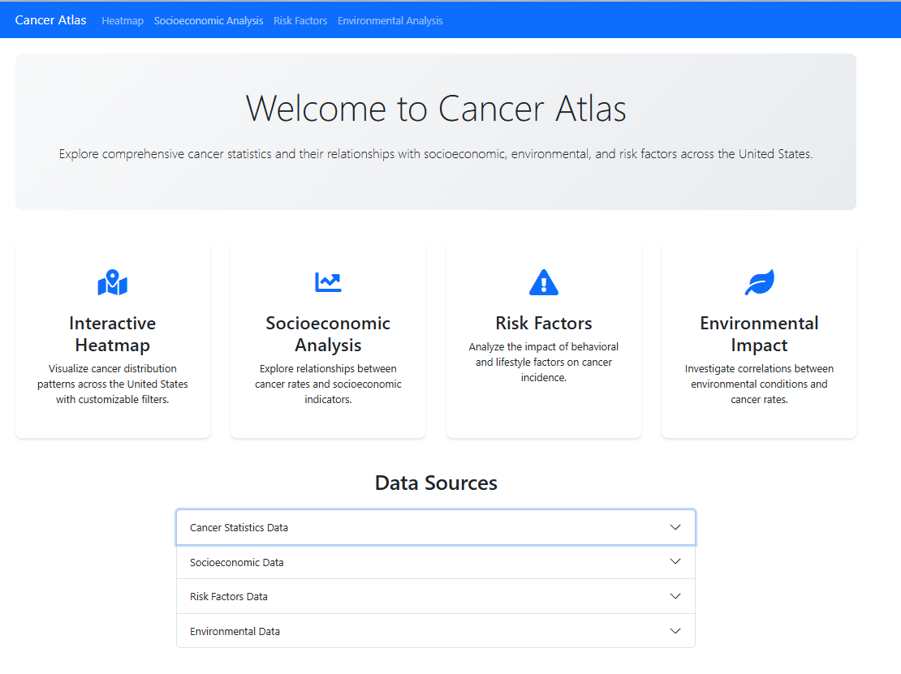
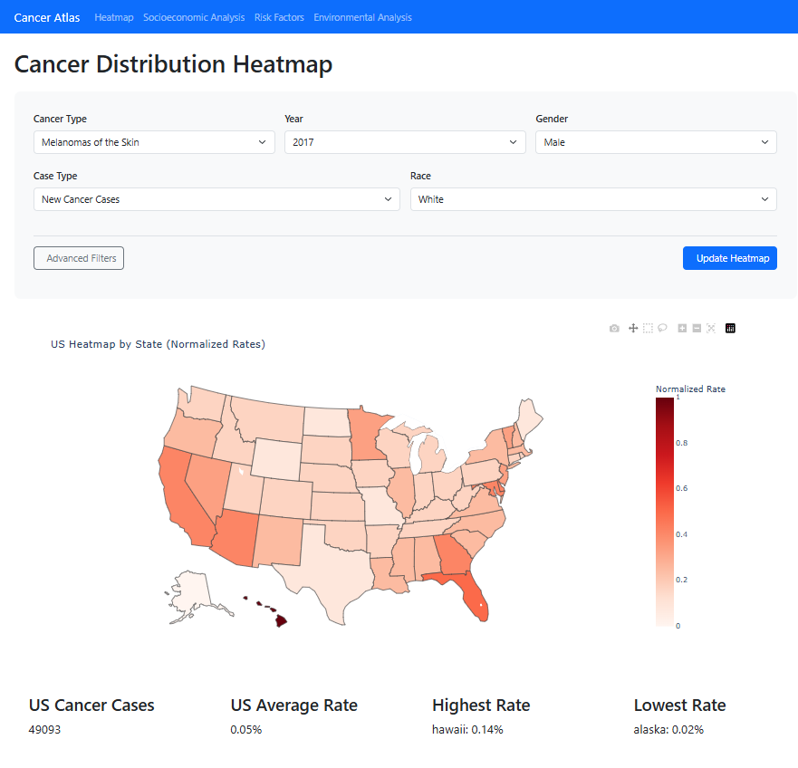
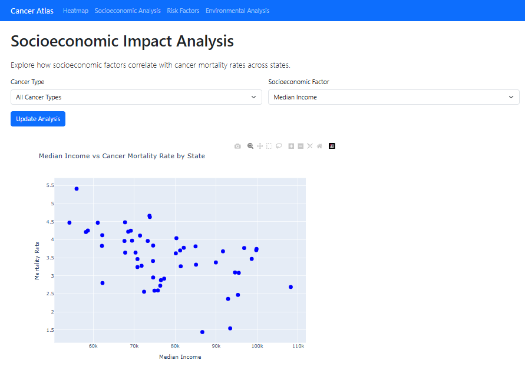
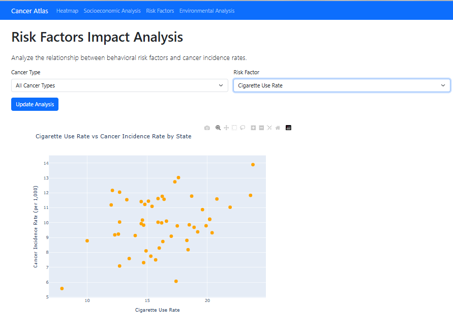
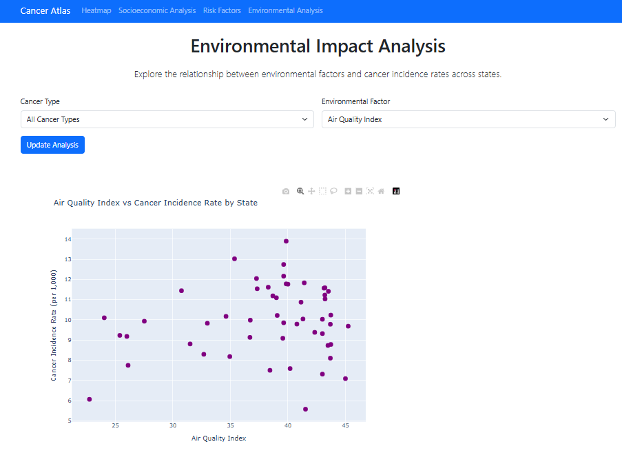

# Cancer Atlas
*A data-driven research tool exploring cancer rates, socioeconomic inequality, and environmental factors across U.S. states.*

[🎥 Watch the Demo](/cancer_atlas_video.mp4)

## 🌟 Project Overview  
The goal of this project is to analyze the **relationships between socioeconomic status, environmental quality, risk factors, and cancer rates** across U.S. states.  

Cancer Atlas provides a **powerful research tool** that enables **scientists and policymakers** to make **data-driven decisions** by analyzing **patterns and correlations** between health, environmental, and economic data.  

The platform allows users to analyze **over 45 million cancer cases**, covering both **incidence and mortality rates** at the **state level** across the U.S.

---
## 🏠 Homepage Preview  

---

## 📊 Heatmap Analysis  
The interactive **heatmap** provides multiple filtering and analysis options:  

### 🔎 **Filters**  
- **Basic Filters**:  
  - Cancer Type  
  - Year  
  - Case type (Incidence vs. Mortality)
  - Race
  - Gender

- **Advanced Filters**:  
  - Socioeconomic Indicators (Income, Unemployment, Insurance)  
  - Environmental Factors (Air Quality, CO₂ Emissions)
  - Risk factors (Smoking rate, Inactivity rate)

### 📈 **Calculations**  
- **Demographic Filtering**:  
  - Cancer cases are adjusted based on **gender and race** using **state demographic data**.  
- **Rate Calculation**:  
  - Cancer cases per **filtered population** for each state.  
- **Data Normalization**:  
  - **Max-min normalization** is used to **standardize** differences between states, making the heatmap visually clear.  
- **Data Export**:  
  - Users can **download the dataset** from each page for manual review.

---

## 📉 Socioeconomic Analysis  
**Insight**: Analyzes the impact of **socioeconomic status** on **cancer mortality rates**.  

📌 **Filters Available:**  
✅ **Median Income**  
✅ **Unemployment Rate**  
✅ **Health Insurance Coverage Rate**  

- **Mortality Rate vs. Socioeconomic Indicators**:  
  - A **clear trend** is observed between **median income** and cancer mortality rates.  
  - Other indicators, such as **health insurance coverage rates**, do not show strong trends.  

---

## 🚬 Risk Factor Analysis  
**Insight**: Investigates the effect of **lifestyle risk factors** on **cancer incidence rates**.  

📌 **Filters Available:**  
✅ **Smoking Rate**  
✅ **Physical Inactivity Rate**  

- **Smoking vs. Incidence Rates**:  
  - Higher smoking rates correlate with **higher cancer incidence rates**.  
- **Physical Inactivity vs. Cancer Rates**:  
  - Lower physical activity levels are linked to **higher cancer incidence rates**.

---

## 🌍 Environmental Analysis  
**Insight**: Examines whether **environmental factors** influence cancer rates.

📌 **Filters Available:**  
✅ **Air Quality Index**  
✅ **CO₂ Emissions per Capita**  

- **No strong correlations** were found for environmental factors, based on the metrics examined:  
  - **Median Air Quality Index** (Air pollution levels)  
  - **State-level CO₂ emissions per capita**

--- 

